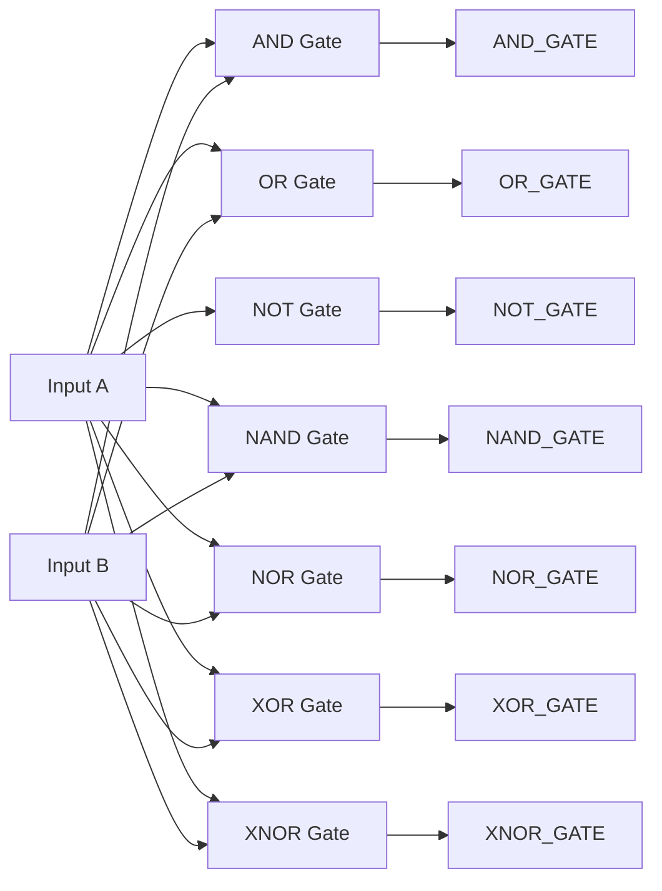

# Basic Logic Gates - Theory of Operation

## Functional Description

Basic logic gates are the foundational building blocks of digital electronic circuits. Each gate implements a specific Boolean function that takes one or more inputs and produces a single binary output. This design implements seven active gates and one declared but unassigned port (the buffer) using dataflow modeling in Verilog. 

Dataflow modeling utilizes continuous assignment statements (`assign`) to express combinational logic. In physical hardware, these expressions compile directly into static logic gates and wire connections. The output of a continuous assignment is updated automatically whenever any input signal on its right-hand side changes. This models the physical propagation delay of gates, where changes at the input pins ripple through to the output pins.

## Circuit Diagram

Since these are parallel, independent basic gates, they do not form a single combined logic network, but rather exist as separate, isolated structures sharing the same inputs:

## How It Works, Step by Step

1. **AND Gate (`AND_GATE`)**: Evaluated via `A & B`. The output is driven high (`1`) only when both A and B are high. If either is low (`0`), the output remains low.
2. **OR Gate (`OR_GATE`)**: Evaluated via `A | B`. The output is driven high when A, B, or both inputs are high. It is low only when both A and B are low.
3. **NOT Gate (`NOT_GATE`)**: Evaluated via `~A`. This is a unipolar inverter. It outputs the inverse of A. If A = 0, output is 1; if A = 1, output is 0.
4. **NAND Gate (`NAND_GATE`)**: Evaluated via `~(A & B)`. This is the inverse of an AND gate. The output is low only when both A and B are high.
5. **NOR Gate (`NOR_GATE`)**: Evaluated via `~(A | B)`. This is the inverse of an OR gate. The output is high only when both inputs A and B are low.
6. **XOR Gate (`XOR_GATE`)**: Evaluated via `A ^ B`. This implements Exclusive-OR logic. The output is high only when A and B have different logical states.
7. **XNOR Gate (`XNOR_GATE`)**: Evaluated via `~(A ^ B)`. This implements Exclusive-NOR (equivalence) logic. The output is high when A and B are identical.
