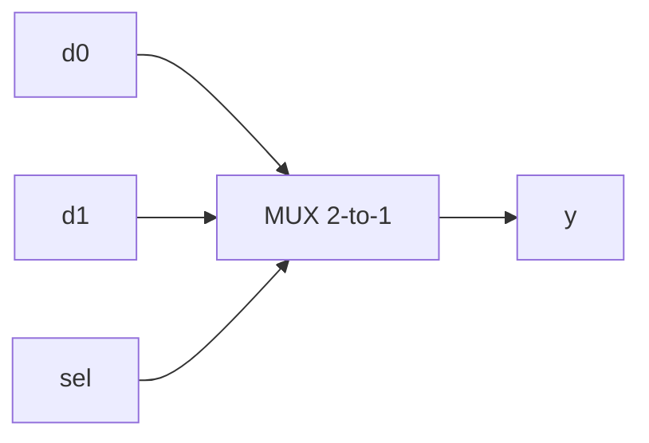

# 2-to-1 Multiplexer (Behavioral) — Theory of Operation

## Functional Description

A 2-to-1 multiplexer (MUX) selects one of two input data lines (`d0`, `d1`) and forwards it to the single output `y` based on the state of the select line (`sel`). Behavioral modeling uses procedural statements (like `if-else` or `case` inside an `always` block) to describe how the circuit's outputs react to input changes algorithmically rather than explicitly instantiating boolean equations.

## Circuit Diagram

## How It Works, Step by Step

1. **Sensitivity List (`always @(*)`)**: The procedural block automatically triggers whenever any input (`d0`, `d1`, or `sel`) changes value.
2. **Conditional Selection (`if-else`)**: 
   - When `sel` is low (`1'b0`), the condition evaluates true, and `y` is assigned the value of `d0`.
   - When `sel` is high (`1'b1`), the `else` branch executes, assigning `d1` to `y`.
3. **Hardware Inference**: Because all possible input paths assign a value to `y` within the combinational procedural block, synthesis tools infer a standard 2-to-1 multiplexer multiplexing logic gate network without creating unintended latches.
