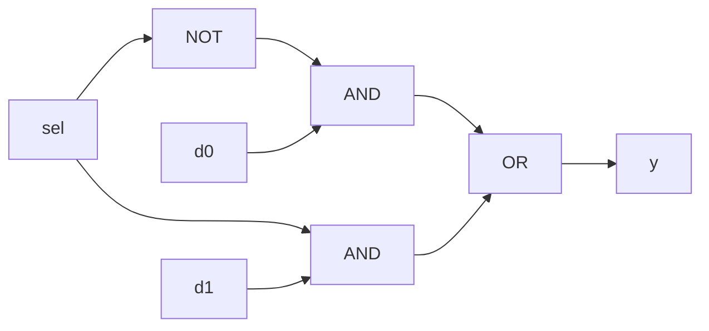

# 2-to-1 Multiplexer (Dataflow) — Theory of Operation

## Functional Description

The dataflow modeling approach expresses the function of a 2-to-1 multiplexer using Boolean equations via the `assign` keyword. Mathematically, a multiplexer output $y$ is expressed in sum-of-products form as:
$$y = \overline{sel} \cdot d_0 + sel \cdot d_1$$

When `sel` is `0`, the first term $\overline{sel} \cdot d_0$ passes $d_0$ while the second term evaluates to `0`. When `sel` is `1`, the first term evaluates to `0` and the second term $sel \cdot d_1$ passes $d_1$.

## Circuit Diagram

## How It Works, Step by Step

1. **Inversion**: Input `sel` is inverted (`~sel`) to enable `d0` when `sel` is low.
2. **AND Operations**: `~sel & d0` isolates `d0` when `sel = 0`; `sel & d1` isolates `d1` when `sel = 1`.
3. **OR Operation**: The outputs of both AND terms are combined using `|`. Because only one term can be active at any given time, the OR gate successfully routes the chosen input to output `y`.
