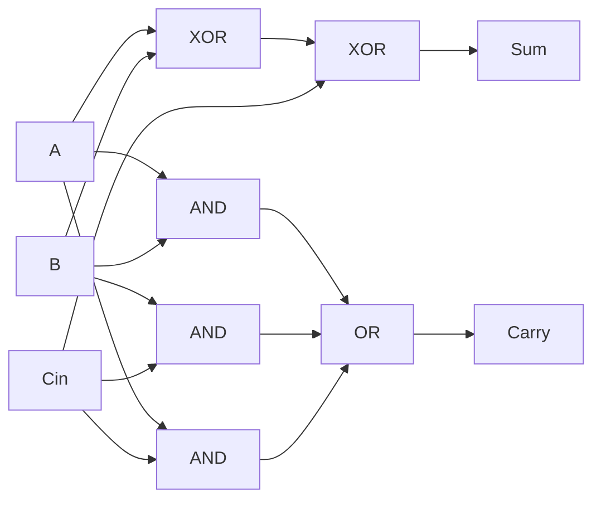

# 1-Bit Full Adder — Theory of Operation

## Functional Description

A full adder is a combinational circuit that adds two operand bits, `A` and `B`, together with an input carry bit, `Cin`. It produces a two-bit result: `Sum` is the least-significant bit and `Carry` is the most-significant bit.

In this design, `Sum` is generated by XORing all three inputs. `Carry` is generated by ORing the three pairwise AND terms. This makes `Carry` high whenever at least two inputs are high. The Verilog implementation uses continuous assignments, so the outputs respond directly to the current input values and no clock or reset is required.

## Circuit Diagram

The upper path implements `Sum = A ^ B ^ Cin`. The lower path implements `Carry = (A & B) | (B & Cin) | (A & Cin)`.

## How It Works, Step by Step

1. The first XOR combines `A` and `B`.
2. The second XOR combines that result with `Cin` and drives `Sum`.
3. Three AND gates detect the input pairs `A&B`, `B&Cin`, and `A&Cin`.
4. The OR gate combines the pairwise carry terms and drives `Carry`.
5. For `000`, the result is `00`; for `111`, the result is `11`. The testbench applies all eight possible input combinations and records the transitions in `full_adder.vcd`.