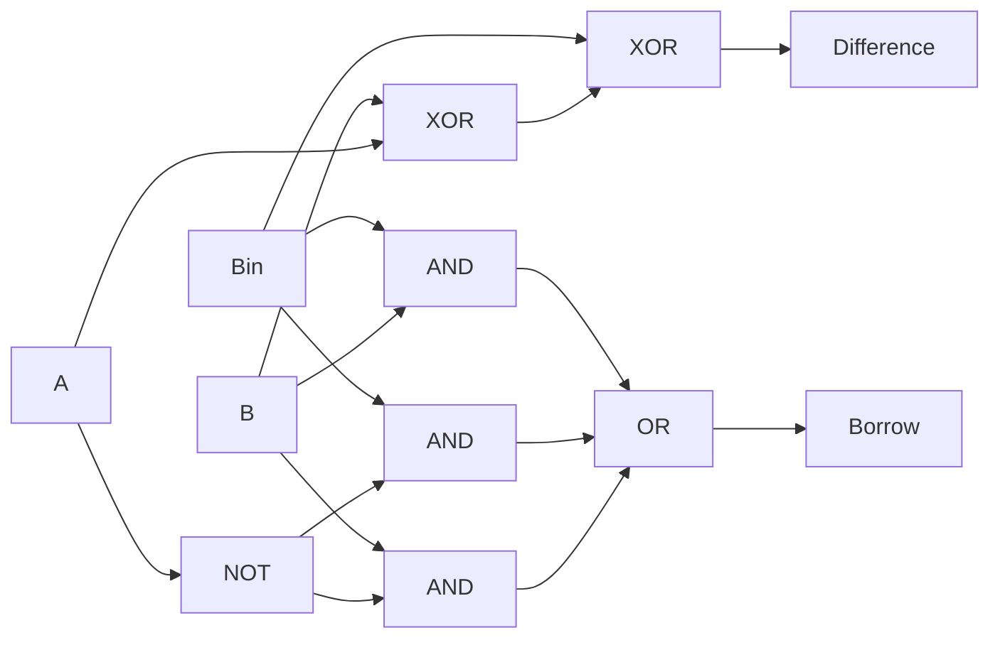

# 1-Bit Full Subtractor — Theory of Operation

## Functional Description

A full subtractor performs the operation `A - B - Bin`, where `A` is the minuend bit, `B` is the subtrahend bit, and `Bin` is the borrow input from a lower-order stage. It produces `Difference` and an output `Borrow` for the next higher-order stage.

The difference is high when an odd number of the three inputs is high, so it is implemented with a three-input XOR. Borrow is high when `A` is zero while `B` or `Bin` is high, or when both `B` and `Bin` are high. The circuit is combinational and uses continuous assignments, so no clock or reset is required.

## Circuit Diagram

The upper path implements `Difference = A ^ B ^ Bin`. The lower path implements `Borrow = ((~A) & B) | ((~A) & Bin) | (B & Bin)`.

## How It Works, Step by Step

1. `A` and `B` are XORed, and that result is XORed with `Bin` to produce `Difference`.
2. `A` is inverted because a borrow is possible when the minuend bit is zero.
3. The inverted `A` is ANDed separately with `B` and `Bin`.
4. `B` and `Bin` are also ANDed together to cover the case where both subtraction terms require a borrow.
5. The three borrow terms are ORed to produce `Borrow`.