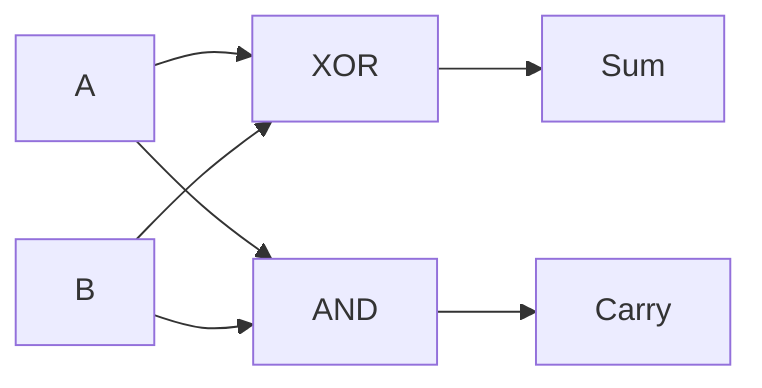

# 1-Bit Half Adder — Theory of Operation

## Functional Description

A half adder adds two one-bit inputs, `A` and `B`. It produces `Sum` as the least-significant result bit and `Carry` as the most-significant result bit. Since it has no carry input, it is suitable for the least-significant stage of a simple binary addition.

The sum is high when exactly one input is high, which is the XOR function. The carry is high only when both inputs are high, which is the AND function. The design is combinational and requires no clock or reset.

## Circuit Diagram

The XOR gate implements `Sum = A ^ B`, and the AND gate implements `Carry = A & B`.

## How It Works, Step by Step

1. Inputs `A` and `B` are applied to the XOR gate.
2. The XOR output is `1` when the inputs are different and drives `Sum`.
3. The same inputs are applied to the AND gate.
4. The AND output is `1` only when both inputs are `1` and drives `Carry`.
5. For input `11`, the result is `Sum=0` and `Carry=1`; for all other input combinations, the outputs follow the truth table in the report.