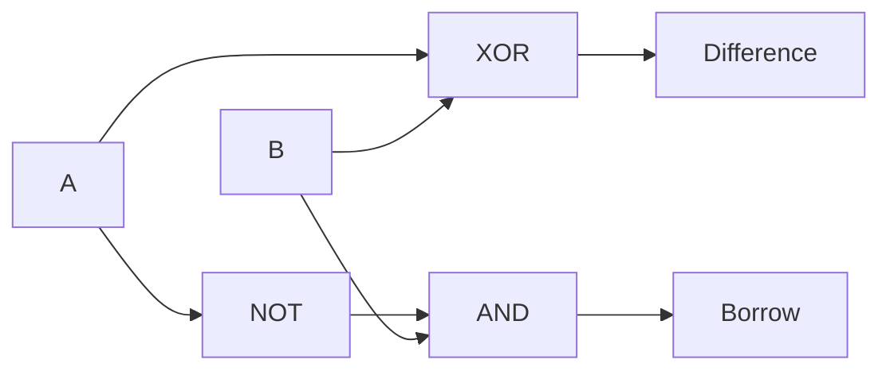

# 1-Bit Half Subtractor — Theory of Operation

## Functional Description

A half subtractor performs the operation `A - B` for two one-bit inputs. `A` is the minuend and `B` is the subtrahend. The circuit produces `Difference` as the result bit and `Borrow` when the subtraction requires borrowing from a higher-order bit.

The difference is high when the two inputs are different, so it is implemented with XOR. Borrow occurs only when `A=0` and `B=1`, which is implemented by inverting `A` and ANDing it with `B`. The circuit is combinational and requires no clock, reset, or borrow input.

## Circuit Diagram

The XOR gate implements `Difference = A ^ B`. The NOT and AND gates implement `Borrow = (~A) & B`.

## How It Works, Step by Step

1. Inputs `A` and `B` are applied to the XOR gate.
2. The XOR output drives `Difference`, which is `1` when the inputs differ.
3. Input `A` is inverted to detect that the minuend is zero.
4. The inverted `A` is ANDed with `B` to generate `Borrow`.
5. Therefore, input `01` produces `Difference=1` and `Borrow=1`; the other input combinations do not generate a borrow.