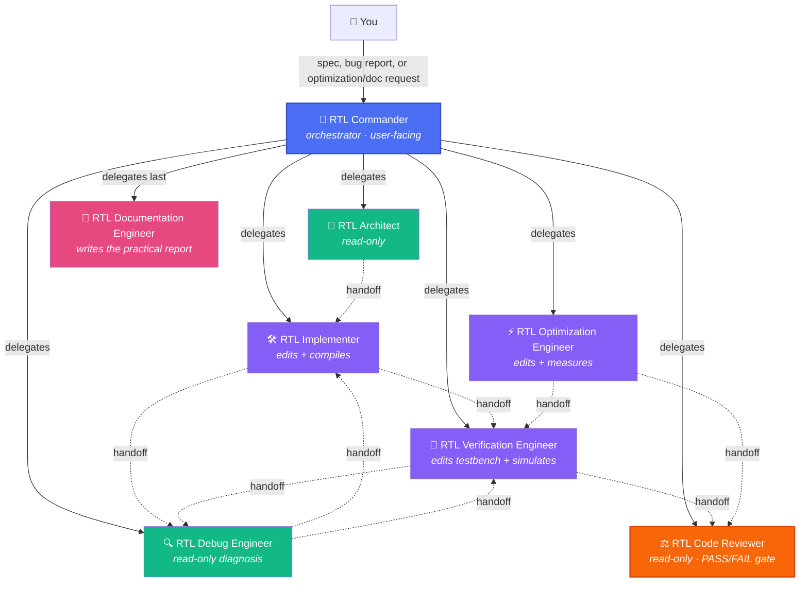
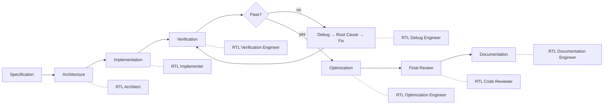
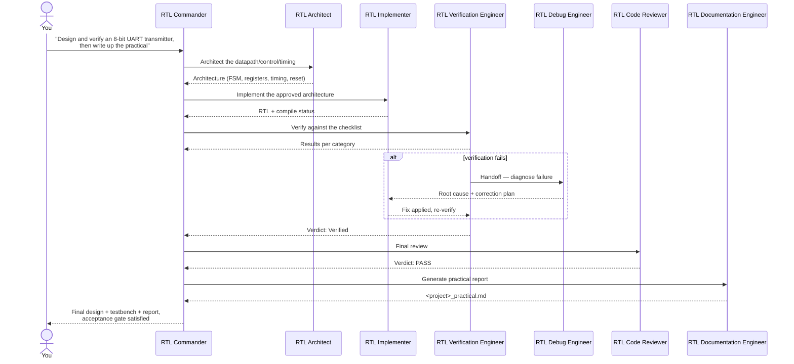
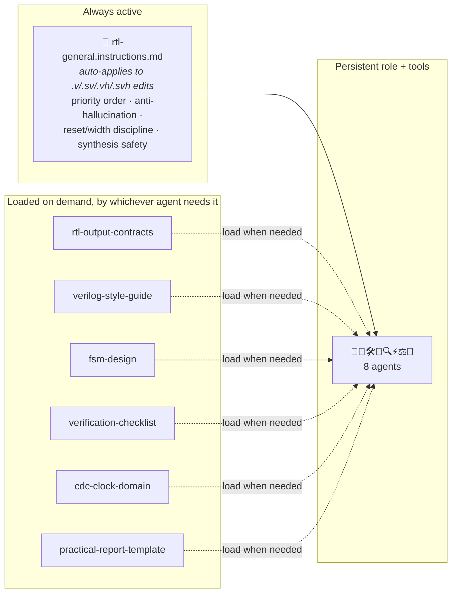
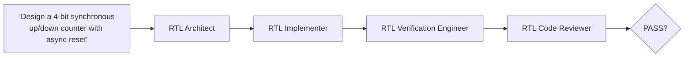
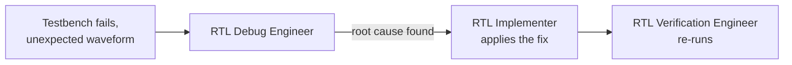
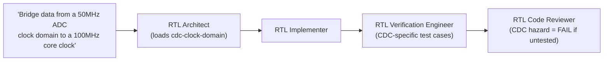
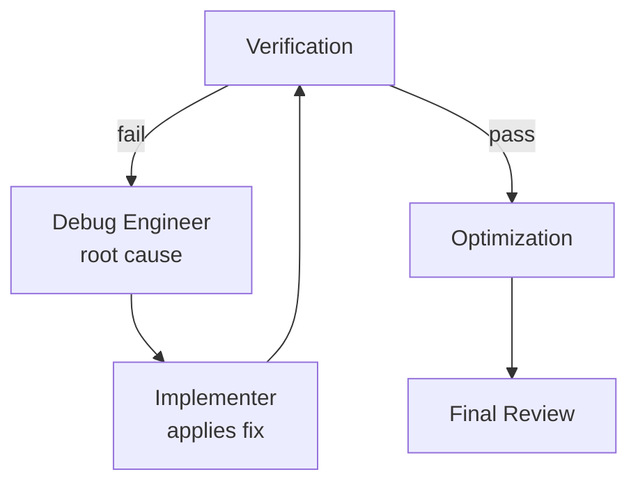

# Verilog RTL Engineering Agent Army

**A production-grade GitHub Copilot / VS Code custom-agent team for the full RTL engineering lifecycle** — architecture, implementation, verification, debugging, optimization, review, and print-ready practical documentation, for synthesizable Verilog / SystemVerilog design.

```
1 Commander  +  7 Specialists  +  6 Skills  +  1 Shared Instructions File
```

Hardware-first reasoning throughout. No agent claims a design is verified
because it merely compiled. No agent invents synthesis or simulation
results.

---

## Table of Contents

1. [What this is](#1-what-this-is)
2. [Architecture at a glance](#2-architecture-at-a-glance)
3. [Installation](#3-installation)
4. [The team, one by one](#4-the-team-one-by-one)
5. [How to use it — by purpose](#5-how-to-use-it--by-purpose)
6. [How delegation actually works](#6-how-delegation-actually-works)
7. [Skills vs. Instructions vs. Agents — why the split](#7-skills-vs-instructions-vs-agents--why-the-split)
8. [Practical workflows (worked examples)](#8-practical-workflows-worked-examples)
9. [The iterative correction loop](#9-the-iterative-correction-loop)
10. [Guardrails & safety model](#10-guardrails--safety-model)
11. [Customizing the army](#11-customizing-the-army)
12. [Troubleshooting](#12-troubleshooting)
13. [FAQ](#13-faq)

---

## 1. What this is

This repository configures a **team of specialized VS Code / GitHub
Copilot custom agents** (`.agent.md` files) for RTL design instead of one
generic coding assistant. Each agent has a narrow job, only the tools it
needs, and hard rules about what it must never claim. An orchestrator —
**RTL Commander** — reads your specification, decides which specialists
are actually needed, sequences architecture → implementation →
verification → (debug loop) → optimization → review → documentation, and
enforces a strict priority order at every step.

This is built for:

- Turning a spec into synthesizable, verified Verilog/SystemVerilog
- Debugging real failures (latches, multiple drivers, X/Z propagation, CDC hazards) from root cause, not by patching symptoms
- Getting an honest PASS / PASS WITH WARNINGS / FAIL verdict before a design is called done
- Producing a **submission-ready practical report** (theory, architecture, FSM tables, timing, full code, viva questions) with zero fabricated numbers

> **Design principle:** functional correctness before synthesizability
> before hardware safety before clock/reset correctness before timing
> before width/sign correctness before verification before efficiency
> before maintainability before readability before brevity — in that
> exact order, every time.

---

## 2. Architecture at a glance

### 2.1 The org chart



**Solid arrows** = Commander delegation, in priority order.
**Dashed arrows** = handoff buttons offered after a specialist finishes, so you stay in control of the next step.

### 2.2 The lifecycle these agents cover



Never optimize before verification passes. Never document a design as
successful if it isn't. Never call something PASS with an open functional
or synthesizability issue.

### 2.3 File layout

```
verilog-rtl-army/
├── README.md                                    ← you are here
├── .github/
│   ├── agents/                                   ← the 8 .agent.md files
│   │   ├── rtl-commander.agent.md
│   │   ├── rtl-architect.agent.md
│   │   ├── rtl-implementer.agent.md
│   │   ├── rtl-verification-engineer.agent.md
│   │   ├── rtl-debug-engineer.agent.md
│   │   ├── rtl-optimization-engineer.agent.md
│   │   ├── rtl-code-reviewer.agent.md
│   │   └── rtl-documentation-engineer.agent.md
│   ├── instructions/
│   │   └── rtl-general.instructions.md          ← auto-applies to .v/.sv/.vh/.svh edits
│   └── skills/                                   ← loaded on demand, shared across agents
│       ├── rtl-output-contracts/SKILL.md
│       ├── verilog-style-guide/SKILL.md
│       ├── fsm-design/SKILL.md
│       ├── verification-checklist/SKILL.md
│       ├── cdc-clock-domain/SKILL.md
│       └── practical-report-template/SKILL.md
```

---

## 3. Installation

1. Copy the `.github/` folder from this repo into the root of **your** RTL
   project. If your project already has a `.github/` folder, merge —
   don't overwrite.
2. Open the project in VS Code with GitHub Copilot Chat enabled.
3. Open the Chat view → agent picker dropdown → you should see
   **RTL Commander**, **RTL Architect**, **RTL Implementer**,
   **RTL Verification Engineer**, **RTL Debug Engineer**,
   **RTL Optimization Engineer**, **RTL Code Reviewer**, and
   **RTL Documentation Engineer** alongside the built-in agents.
4. If nothing shows up: run **Chat: Open Customizations** → **Agents**
   tab to confirm discovery of `.github/agents/`, or right-click in the
   Chat view → **Diagnostics** to see load errors.
5. For simulation/compilation steps (Icarus Verilog, Verilator, or a
   vendor toolchain), make sure the relevant CLI tools are on your
   `PATH` — the agents will use whatever is actually available and will
   say so explicitly when nothing is.

> **Verify tool names for your setup.** These agents use VS Code's current
> namespaced tool identifiers (e.g. `execute/runInTerminal` rather than
> the older `runCommands`). If a tool is unavailable in your installed
> version it's silently ignored rather than erroring — so if a specialist
> seems to be missing a capability it should have, check that agent's
> tools picker against what your version actually exposes.

---

## 4. The team, one by one

| | Agent | What it's for | Can edit files? | Can run/simulate? |
|---|---|---|:---:|:---:|
| 🧭 | **RTL Commander** | Reads the spec, decides which specialists are needed, enforces the priority order and acceptance gate | ❌ | ❌ |
| 📐 | **RTL Architect** | Datapath/control/FSM/timing/reset architecture, before any RTL is written | ❌ | ❌ |
| 🛠️ | **RTL Implementer** | Converts approved architecture into synthesizable Verilog/SystemVerilog | ✅ | ✅ *(compile/lint)* |
| 🧪 | **RTL Verification Engineer** | Writes and runs testbenches; proves behavior with simulation, not inspection | ✅ *(testbench only)* | ✅ |
| 🔍 | **RTL Debug Engineer** | Root-cause diagnosis of failures — never patches symptoms | ❌ | ✅ *(reproduce only)* |
| ⚡ | **RTL Optimization Engineer** | Area/timing/power optimization, only after verification passes, always measured | ✅ | ✅ |
| ⚖️ | **RTL Code Reviewer** | Final independent PASS / PASS WITH WARNINGS / FAIL gate | ❌ | ❌ |
| 📄 | **RTL Documentation Engineer** | Generates the print-ready practical report — last step | ✅ *(report only)* | ❌ |

**Rule of thumb:** the read-only agents (📐 🔍 ⚖️) can never touch your
RTL no matter what they're asked — that's enforced by their tool grants,
not just instructions. RTL Implementer and RTL Debug Engineer are
deliberately separate agents so a bug is never "fixed" without a
documented root cause first.

---

## 5. How to use it — by purpose

### 📐 "I have a spec, help me design the hardware for it"
→ **RTL Architect** (or just describe it to **RTL Commander**, which will
route here first for anything non-trivial). You'll get datapath, control
logic, FSM, register/counter plan, timing, reset architecture, and
hazards — before a single line of RTL is written.

### 🛠️ "Implement this module"
→ **RTL Implementer**. Correct blocking/nonblocking usage, no inferred
latches, no multiple drivers, explicit widths and reset behavior — every
time, per the `verilog-style-guide` skill.

### 🧪 "Does this design actually work?"
→ **RTL Verification Engineer**. It will not tell you a design is
verified because it compiled — it builds a testbench covering normal
operation, boundaries, reset, repeats, invalid inputs, min/max, FSM
transitions, and timing-sensitive cases, and reports Observed pass/fail
per category.

### 🔍 "Why is this failing / this waveform looks wrong"
→ **RTL Debug Engineer**. Traces X/Z propagation, latch inference,
multiple drivers, and race conditions to their actual root cause, then
hands a precise correction plan to RTL Implementer — it won't just patch
the symptom.

### ⚡ "Reduce resource usage / improve timing"
→ **RTL Optimization Engineer**. Only runs on already-verified RTL,
always measures a baseline first (or says "Not measured" if no toolchain
is available), changes one factor at a time, and re-confirms functional
equivalence afterward.

### ⚖️ "Is this design actually done?"
→ **RTL Code Reviewer**. Independent, read-only, and will return FAIL —
not a softened "PASS WITH WARNINGS" — if a real functional or
synthesizability issue remains.

### 📄 "Write up the practical / generate the submission report"
→ **RTL Documentation Engineer**. Produces the full 24-section report
(theory, architecture, block diagram, FSM tables, timing, complete
RTL + testbench code, verification results, resource considerations,
checklist, viva questions) — with "Not measured" wherever a number wasn't
actually obtained, never a fabricated one.

### 🧭 "I just have a spec, take it from here"
→ **RTL Commander**. Runs the whole pipeline, only invoking the
specialists a given task actually needs, and won't declare
`FINAL — VERIFIED RTL DESIGN` until the full acceptance gate is satisfied.

---

## 6. How delegation actually works



Two ways to trigger this:

1. **Talk to RTL Commander directly** — best for a full spec-to-report
   pipeline, or when you're not sure which phase you're actually in.
2. **Pick a specialist yourself** from the agent dropdown — best when you
   know exactly what you need (e.g. straight to RTL Debug Engineer with a
   specific failing waveform). Specialists hand off to each other via the
   **handoff buttons** under their responses.

---

## 7. Skills vs. Instructions vs. Agents — why the split



| Type | Use when it's... | Example here |
|---|---|---|
| **Agent** | A persistent role needing its own tools, guardrails, independent judgment | RTL Code Reviewer's read-only, PASS/FAIL-only mandate |
| **Skill** | Reusable, reference-heavy, needed by *multiple* agents | `fsm-design` — used by Architect, Implementer, Verification Engineer, *and* Documentation Engineer |
| **Instructions** | A repo-wide convention that should apply automatically | The anti-hallucination rule and priority order — every agent inherits these without needing to ask |

This is also why the team stayed at 8 agents instead of growing further:
Debug Engineer and Implementer, or Optimization Engineer and a
hypothetical separate "synthesis agent," share enough tooling and
reasoning mode that splitting them further would just be the same role
twice.

---

## 8. Practical workflows (worked examples)

### Workflow A — New module from spec to review



**Prompt:** *"Design and implement a 4-bit synchronous up/down counter with asynchronous active-low reset, verify it, and review it."*

### Workflow B — Debugging a failing simulation



**Prompt:** *"My FSM gets stuck in the WAIT state after a few cycles — here's the waveform. Debug it."*

### Workflow C — Multi-clock design needing CDC discipline



**Prompt:** *"I need to bring an 8-bit ADC sample from a 50 MHz domain into my 100 MHz core clock domain safely."*

### Workflow D — End-to-end via Commander, with report

**Prompt:** *"Design, implement, verify, and optimize an 8-entry FIFO, then generate the practical report for submission."*
→ Commander sequences Architect → Implementer → Verification → (Debug loop if needed) → Optimization → Reviewer → Documentation Engineer, and only calls the design `FINAL — VERIFIED RTL DESIGN` once the full acceptance gate is satisfied.

---

## 9. The iterative correction loop



This loop repeats until functional verification actually passes — the
Commander will not skip ahead to optimization, review, or documentation
while it's still failing, and will report an honest **Partially
Verified** or **Not Verified** status rather than declaring success if
the loop can't converge within reasonable attempts (e.g. the
specification itself needs clarification).

---

## 10. Guardrails & safety model

- **Read-only by construction**: RTL Architect, RTL Debug Engineer, and RTL Code Reviewer have no `edit` tool in their frontmatter — they cannot change your RTL, not just "are told not to."
- **Diagnosis and fix are separate agents**: RTL Debug Engineer finds the root cause; RTL Implementer applies the fix. No agent both diagnoses and silently patches in the same step.
- **No PASS with an open issue**: RTL Code Reviewer's instructions make this a hard rule, not a preference — a FAIL-worthy issue can never be reported as PASS WITH WARNINGS to look cleaner.
- **No fabricated numbers, anywhere**: the anti-hallucination rule in `rtl-general.instructions.md` applies automatically to every `.v`/`.sv` edit and is repeated in every agent that could be tempted to estimate a number (simulation results, LUT/FF counts, max frequency, timing slack). "Not measured" is always an acceptable, expected answer when no toolchain was run.
- **Optimization gated on verification**: RTL Optimization Engineer's own instructions require confirming verification status before it will touch anything.
- **No AI-narrator language in deliverables**: the practical report and code comments read like normal engineering artifacts.

---

## 11. Customizing the army

- **Add a new toolchain** (e.g. a specific simulator or a vendor synthesis tool): extend the relevant specialist's `execute/*` usage — the agents already say what they'd run, just make sure the CLI is on `PATH`.
- **Add a new domain reference** (e.g. AXI protocol conventions, a specific FPGA vendor's primitive library): add a new Skill under `.github/skills/` rather than growing an agent's body.
- **Change a house rule** (e.g. your team's specific reset convention or report template): edit `rtl-general.instructions.md` or `practical-report-template` once — it propagates everywhere automatically.
- **Restrict delegation**: adjust the `agents:` allowlist in `rtl-commander.agent.md`, or set `disable-model-invocation: true` on a specialist to hide it from subagent use entirely.

---

## 12. Troubleshooting

| Symptom | Likely cause | Fix |
|---|---|---|
| Agent doesn't appear in the picker | Malformed YAML frontmatter | Right-click Chat view → **Diagnostics** |
| Agent seems to be missing a tool it should have | Tool name mismatch with your installed Copilot version | Check that agent's tools picker against live tool names |
| Skill never seems to get used | Skill `name:` doesn't match its directory name | Rename to match exactly — mismatched skills are silently skipped |
| Commander won't delegate to a specialist | `agent` tool missing, or specialist name in `agents:` doesn't exactly match the specialist's `name:` field (case-sensitive) | Check both spellings match verbatim |
| Verification Engineer reports "Not Run" for everything | No simulator on `PATH` in this environment | Install/expose Icarus Verilog, Verilator, or your vendor toolchain |
| Report has "Not measured" everywhere in section 19 | No synthesis toolchain was actually run — this is correct, working-as-intended behavior | Run your synthesis tool via RTL Optimization Engineer first if you want real numbers |

---

## 13. FAQ

**Will this ever tell me a design passes when it doesn't?**
No — by design. RTL Code Reviewer's hard rule is never to return PASS with an open functional or synthesizability issue, and RTL Verification Engineer never reports "Verified" without Observed simulation evidence.

**Can I use this for a university lab practical?**
Yes — the RTL Documentation Engineer's output (`<project_name>_practical.md`) follows a standard 24-section lab-report structure (aim, theory, architecture, FSM, timing, code, testbench, verification, resource considerations, checklist, viva questions) and is written to read as a normal submission, not an AI transcript.

**Does it handle multi-clock designs safely?**
Yes — `RTL Commander` automatically routes multi-clock or async-input designs through CDC-aware architecture, implementation, verification, and review, using the `cdc-clock-domain` skill at each stage.

**What if I don't have a simulator installed in this environment?**
Every agent will say "Not Run" / "Not measured" explicitly rather than guessing — you'll get complete RTL and testbenches either way, with honest labeling of what's been actually proven versus not yet checked.

---

*Generated as part of the RTL Agent Army architecture design, following the same minimal-redundancy, evidence-first design principles as the companion ML Agent Army.*
